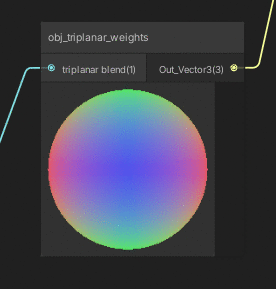

# shadersubgraphs

trip_mul_tex  :  

masked_tint_simple : 

obj_triplanar_weights : 

tri_voronoi_bump : 

simple_noise_remap : 

sg_noise_remap : same as simple_noise_remap + you choose between simple noise and gradient noise
